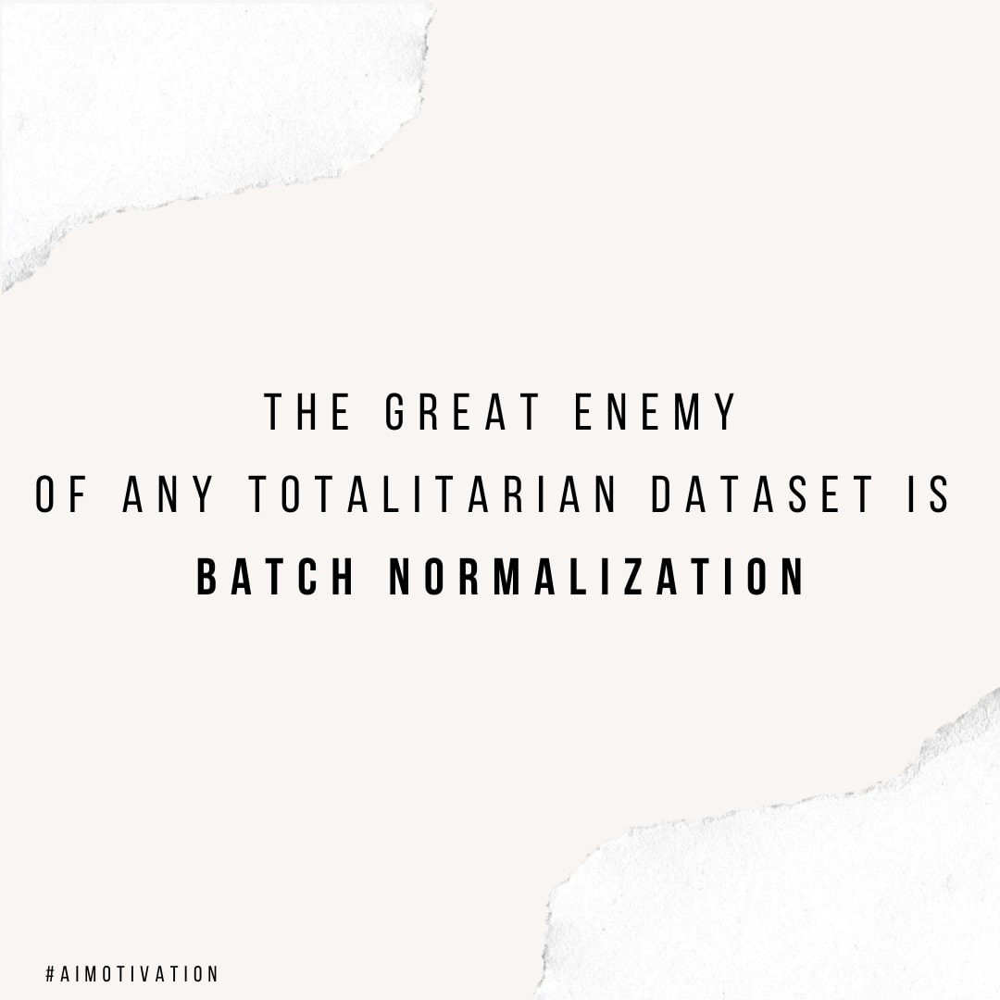

# Neural Networks and Deep Learning

## Neural networks
   its a beautiful biologically-inspired programming paradigm which enables a computer to learn from observational data
## Deep learning
   Its a powerful set of techniques for learning in neural networks
## Computer Vision
   often abbreviated as CV, is defined as a field of study that seeks to develop techniques to help computers “see” and understand the content of digital images such as photographs and videos.

## Neural networks and deep learning currently provide the best solutions to many problems in image recognition, speech recognition, and natural language processing. Here we will see many of the core concepts behind neural networks and deep learning.

